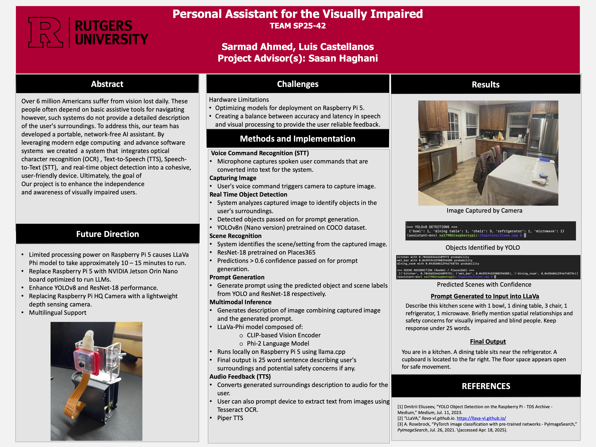

## Hardware and Price

| Component                | Cost      |
|---------------------------|----------|
| Raspberry Pi 5 (16 GB)    | $120      |
| AI Hat+ (26 TOPS)         | $110      |
| Raspberry Pi HQ Camera    | $50       |
| HQ Camera Lens            | $25       |
| Power Bank                | $55       |
| Chest Mount               | $14       |
| USB Microphone            | $23       |
| SD Card                   | $7        |
| Misc. (case, cables, etc) |~$30      |
| **Total**                 | **$434**  |
